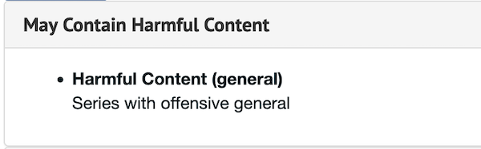
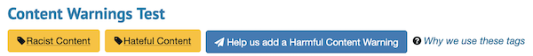

ArchivesSpace Content Warnings
=============================

## Note: In Testing & Development Phase
This plugin is currently in the beta phase, so please test first with non-production
systems & data.

## Getting started

This plugin has been tested with ArchivesSpace versions 3.1.1+.

Unzip the latest release of the plugin to your
ArchivesSpace plugins directory:

     $ cd /path/to/archivesspace/plugins
     $ unzip aspace_offensive_content_tags.zip -d aspace_offensive_content_tags

Enable the plugin by editing your ArchivesSpace configuration file
(`config/config.rb`):

     AppConfig[:plugins] = ['other_plugin', 'aspace_content_warnings']

(Make sure you uncomment this line (i.e., remove the leading '#' if present))

See also:

  https://github.com/archivesspace/archivesspace/blob/master/plugins/README.md

You will need to shut down ArchivesSpace and migrate the database:

     $ cd /path/to/archivesspace
     $ scripts/setup-database.sh

See also:

  https://github.com/archivesspace/archivesspace/blob/master/UPGRADING.md

This will create the tables required by the plugin, and will pre-populate the
system with a set of Content Warnings. The controlled value list is editable.
The plugin provides the following warnings out of the box.
```
cw_adult: Adult Content
cw_general: Harmful Content (general)
cw_hate: Hateful Content
cw_racism: Racist Content
```

## Configuration

This plugin accepts four configuration options. One controls the visibility of Content Warnings
as facets in the staff application and the visibility of Content Warnings
as facets in the PUI. Set either `staff_faceting` or `public_faceting` to `true` to
enable Content Warnings facets in that area. Another option `general_only` can be set to true to disable
specific warning tags in the PUI and display only the general warning in the PUI.

```
AppConfig[:aspace_content_warnings] = {
  'staff_faceting' => true,
  'public_faceting' => true,
  'general_only' => true
}
```

The third configuration option specifies a link to an external site that explains the use of the
content warnings if your institution provides that information. Set

```
AppConfig[:aspace_content_warnings_external_link]
```

to any valid URL. The link will appear below any tags with language specified by the value set in
the `aspace_content_warnings_more_info` locales key.

The fourth configuration option adds a form to collect proposals for additional content warning tags.
It relies on the request form mechanism to a large extent and requires that the same AppConfig
settings regarding emails for the PUI be set. Set

```
AppConfig[:aspace_content_warnings_allow_pui_submit] = true
```
to enable the form on objects that allow requests.

See the PUI images below for examples of how these would appear in the PUI with the config options
enabled.

## Using the Plugin

The plugin adds a new sub record to Accessions, Resources, Archival Objects, and Digital Objects.
The new sub record allows staff users to select a type of content warning and optionally a
clarifying description of why the warning has been applied. Any number of warnings can be applied.

### Staff editing UI


If an object has been labeled directly, the plugin adds new data to the accordion section in the
PUI which lists out the warnings applied and the custom description if added. A generic description
is applied if no custom description is available.

## PUI Accordion Section


In addition, the plugin adds warning tags just under the title of the object which, when clicked,
will open the accordion section and scroll to the content warning section.

### PUI Tag Section


If an object has not been labeled directly, the plugin checks to see if any ancestors have had any
warnings applied and adds a set of inherited warning tags just under the title of the object prefixed
with text indicating where the tag(s) where inherited from. The inheritance check stops at the first
ancestor with directly applied tags.

Example Statement for an inherited tag: `Applied at the Series level: {TAG}`

### PUI Tag Section - Direct Tag


### PUI Tag Section - Inherited Tags


### PUI - General Tag Only Configuration

Note that if the configuration option to only display the general tag is set, only that tag & warning
will be displayed in the PUI for direct and inherited tags.

### PUI PDF Export

The PUI PDF exports have also been modified to include the **directly** applied tags. Inherited tags
are **not** included in the pdf export.

A sample PUI pdf export is included in the `sample_exports` directory.

## Adding Additional Content Warning Choices

To add new content warnings, admin users should edit the controlled value list.
```
System Menu - Controlled Value Lists - Content Warnings
```

In addition the locales should be updated with new translations for the warning label and the default
description associated with the tag. To edit the label translation, please edit
`frontend/locales/enumerations.en.yml` and add a new `key:value` pair to
```
en:
  enumerations:
    content_warning_code:
      cw_new: New Content Warning (Example)    
```

In this example, 'new' should be a descriptive name for the type of content.

To add a new default description, edit `frontend/locales/en.yml` and add a new `key:value` pair
to
```
en:
  content_warning_description:
    cw_new: >
      This is a new example description for a new content warning.    
```  

## Reports

The plugin adds an additional report that gathers information about the content warnings applied. The
report includes the warning and any associated primary type (resource, accession, archival object,
and digital object).

## Staff EAD & PDF Exports Note

EAD, EAD3, and pdf exports include sections with any applied content warnings.

## Core Overrides

This plugin overrides several methods related to EAD & EAD3 export. If you have modified these or
are using plugins that also modify these methods, you will need to reconcile them. Specifically

```
    EADSerializer::stream
    EADSerializer::serialize_child
    EAD3Serializer::stream
    EAD3Serializer::serialize_child
```    

This plugin also overrides the following views
```
    /public/views/pdf/_resource.html.erb
    /public/views/pdf/_archival_object.html.erb
    /public/views/shared/_record_innards.html.erb
```
If you are using other plugins which override the same files, you will need to reconcile
them.

## Credits

Plugin developed by Joshua Shaw [Joshua.D.Shaw@dartmouth.edu], Digital Library Technologies Group
Dartmouth Library, Dartmouth College
